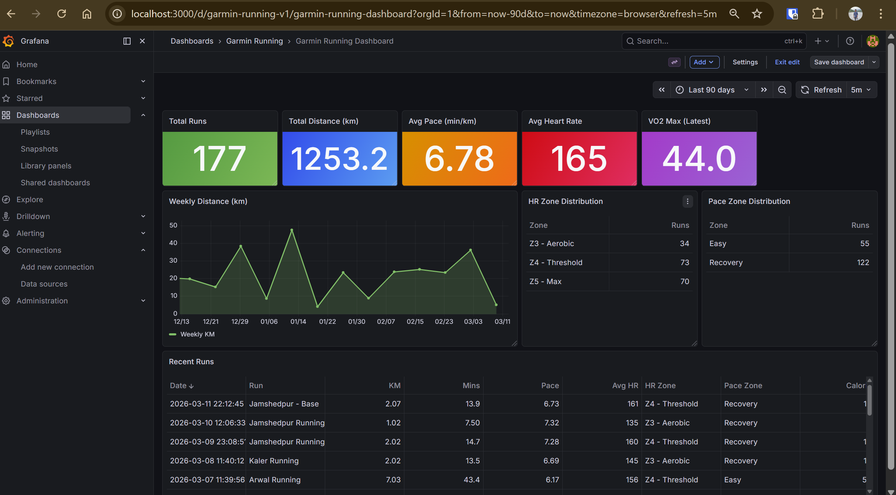

# 🏃 Garmin Running Dashboard

> A production-grade, real-time running analytics pipeline built with 100% open-source tools.
> Automatically syncs Garmin Connect data every 30 minutes into a live Grafana dashboard.


---

## 📸 Dashboard Preview

> Live dashboard showing 1,253 km of running data across 177 activities

| Metric | Value |
|---|---|
| 🗺 Total Distance | 1,253 km |
| 🏃 Total Runs | 177 |
| 🏆 Longest Run | 42.7 km |
| ❤️ Avg Heart Rate | 165 bpm |
| ⚡ Avg Pace | 6:47 /km |
| 🔥 Total Calories | 91,854 |

---

## 🏗 Architecture
```
Garmin Watch
     ↓
Garmin Connect (cloud)
     ↓
python-garminconnect  ←── OAuth token auth
     ↓
Apache Airflow DAG    ←── Runs every 30 minutes
     ↓
TimescaleDB           ←── Hypertable time-series storage
     ↓
dbt transformations   ←── staging → facts → marts
     ↓
Grafana Dashboard     ←── Live auto-refreshing panels
```

---

## 📊 dbt Data Models
```
raw_activities          (raw Garmin JSON)
       ↓
stg_garmin_activities   (cleaned, typed, filtered)
       ↓
fct_runs                (enriched with HR zones, pace zones, effort score)
       ↓
mart_weekly_summary     (aggregated weekly metrics for dashboard)
```

### Transformation Highlights
- **HR Zone classification** — Z1 Recovery through Z5 Max
- **Pace Zone classification** — Recovery, Easy, Threshold, Tempo, Race Pace
- **Effort Score** — composite metric combining distance, elevation and HR
- **Weekly aggregations** — total km, avg pace, zone distribution per week

---

## 🛠 Tech Stack

| Layer | Tool | Version | Purpose |
|---|---|---|---|
| Ingestion | python-garminconnect | Latest | Pulls data from Garmin Connect API |
| Orchestration | Apache Airflow | 2.8 | Schedules pipeline every 30 mins |
| Database | TimescaleDB | PG15 | Time-series optimized storage |
| Transformation | dbt | 1.7 | Layered SQL transformations |
| Visualization | Grafana OSS | Latest | Live dashboard with auto-refresh |
| Infrastructure | Docker Compose | V2 | Single-command full stack deployment |

---

## 🚀 Run It Yourself

### Prerequisites
- Docker Desktop (with WSL2 on Windows)
- Python 3.8+
- Garmin Connect account with activity data

### Quickstart

**1. Clone the repo**
```bash
git clone https://github.com/YOUR_USERNAME/garmin-running-dashboard.git
cd garmin-running-dashboard
```

**2. Add your credentials**
```bash
cp .env.example .env
# Edit .env with your Garmin email and password
```

**3. Start the full stack**
```bash
docker compose up -d
```

**4. Generate Garmin auth token**
```bash
pip install -r requirements.txt
python ingestion/save_garmin_token.py
```

**5. Load your full running history**
```bash
python ingestion/garmin_ingest.py
```

**6. Run dbt transformations**
```bash
cd dbt_project && dbt run
```

**7. Open dashboards**

| Service | URL | Credentials |
|---|---|---|
| Grafana | http://localhost:3000 | admin / admin123 |
| Airflow | http://localhost:8080 | admin / admin123 |


**8. Dashboard Preview**



---

## 📁 Project Structure
```
garmin-running-dashboard/
├── ingestion/
│   ├── garmin_ingest.py          # Main ingestion + pagination
│   └── save_garmin_token.py      # One-time OAuth token setup
├── airflow/
│   └── dags/
│       └── garmin_sync_dag.py    # DAG — runs every 30 mins
├── dbt_project/
│   └── models/
│       ├── staging/
│       │   └── stg_garmin_activities.sql
│       └── marts/
│           ├── fct_runs.sql
│           └── mart_weekly_summary.sql
├── grafana/
│   ├── dashboards/
│   │   └── running_dashboard.json
│   └── provisioning/
│       ├── datasources/
│       │   └── timescaledb.yml
│       └── dashboards/
│           └── dashboard.yml
├── docker/
│   └── init.sql                  # DB schema + TimescaleDB hypertable
├── .env.example                  # Credentials template
├── docker-compose.yml            # Full stack definition
└── requirements.txt
```

---

## 💡 Key Engineering Decisions

**TimescaleDB over plain PostgreSQL**
Hypertables give 10-100x faster queries on time-series data. Continuous aggregates allow pre-computed rollups without touching raw data.

**dbt layered architecture**
Mirrors production data warehouse patterns — raw → staging → facts → marts. Each layer has a single responsibility and is independently testable.

**Paginated Garmin ingestion**
Garmin's API returns max 100 activities per call. The ingestion script paginates through the full history automatically, using `ON CONFLICT DO NOTHING` for idempotent loads.

**OAuth token reuse**
Garmin uses OAuth2. Saving and reusing tokens avoids repeated MFA prompts and rate limiting — critical for a 30-minute scheduled pipeline.

**Docker Compose orchestration**
Entire stack (5 services) spins up with one command. Volume mounts ensure data persists across container restarts.

---

## 🔮 Roadmap

- [ ] Deploy to Azure (ACI + GitHub Actions CI/CD)
- [ ] dbt tests and data quality checks
- [ ] Slack/email alerts for failed Airflow runs
- [ ] Strava data source integration
- [ ] Predictive race time model (scikit-learn)
- [ ] Training load and recovery score panels

---

## 👨‍💻 Author

Built as a **Data Engineering portfolio project** demonstrating:
ELT pipeline design · dbt data modeling · workflow orchestration ·
time-series databases · containerized infrastructure · API integration

---

*If you found this useful, please ⭐ the repo!*